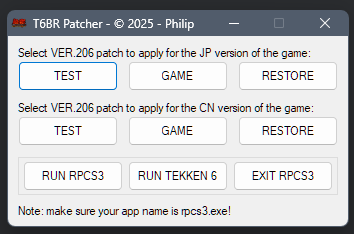

# t6br-patcher

     

## Buttons:    
                            
**TEST:** you can run the game with test menu enabled. Apply settings, save and exit the game, then run the game with your settings.                 
**GAME:** will remove network icon and you will have English subtitles.                  
**RESTORE:** restore original VER.206 settings file.   
**RUN RPCS3:** run the emulator.            
**RUN TEKKEN 6:** run the game directly.                
**EXIT RPCS3:** stop all rpcs3.exe processes.           

---

                                      
**[RobertoTorino](https://github.com/RobertoTorino)**             